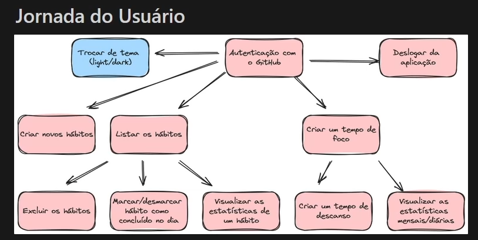

# 1 - Planejamento Fluxograma

# 2 - Requisitos Funcionais (RF’s)

- O usúario deve poder se autenticar com o github
- O usúario deve poder se deslogar
- O usúario deve poder criar novos hábitos
- O usúario deve poder Listar os hábitos
- O usúario deve poder excluir os hábitos
- O usúario deve poder marcar/desmarcar um hábito concluido
- O usúario deve poder visualizar as estatisticas
- O usúario deve poder criar um tempo de foco
- O usúario deve poder criar um tempo de descanso
- O usúario deve poder vizualizar as estatisticas mensais/diarias do tempo de foco

# 3 - Regras de Negócio (RN’s)

- O usuários poderá ficar logado na aplçicação por 8hs, depois é deslogado;
- O usuários poderá criar hábitos com mesmo nome (letras maiuscula e minuscula)
- somente dados dele mesmo
- somente marcar ou desmarcar no mesmo dia
- vizualizar as estatisticas

# 4 - Requisitos não Funcionais (RNF’s)

- Autenticação com o Github + JWT
- Backend com Typescript e com Express.js
- Frontend com Typescript e com React.js
- Banco de Dados Mongodb

# Designer da API

- Post/auth → loguin com github
- Post/habits → cria um novo hábito
- Get/habits → Listar todos os hábitos
- Delete/habits/:id → deletar os hábitos
- Patch/habits/:id/toogle → marca/desmarca o hábito
- Get/habits/:id/metrics?date=2024-01-01 → mostra as estatisticas
- Post/focus-times → cria um tempo de foco
- Get/focus-times/metrics/month?date=2024-01-01 mostra no mês
- Get/focus-times/metrics/day?date=2024-01-01 mostra no dia

# Tecnologias
- Express
- Typescript
- Eslint + Prettier
- Dayjs
- Zod
- axios
- dotenv
- Cors     
- jsonwebtoken
- mongoose
 